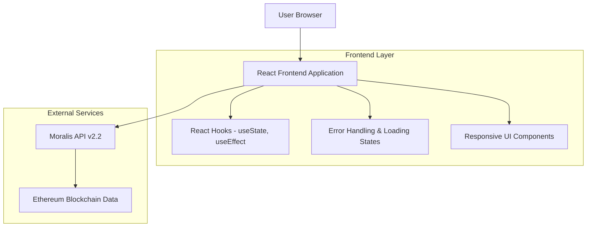
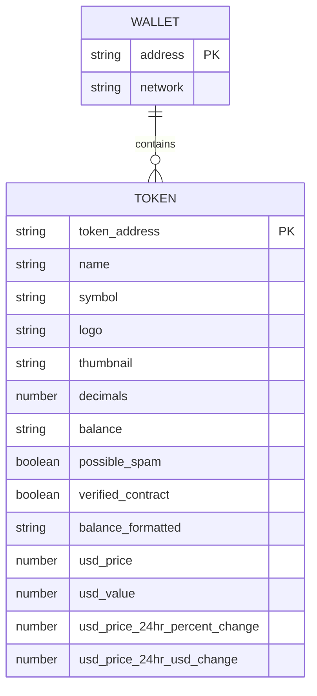

# Moralis Portfolio Tracker - Technical Architecture Document

## 1. Architecture Design



## 2. Technology Description

- **Frontend**: React@19.2 + CSS3 + Create React App
- **API Integration**: Moralis Web3 API v2.2 (REST)
- **State Management**: React Hooks (useState, useEffect)
- **Styling**: Vanilla CSS with responsive design
- **Build Tool**: Create React App (Webpack, Babel)

## 3. Route Definitions

| Route | Purpose |
|-------|---------|
| / | Ana sayfa - wallet adresi girişi ve portföy görüntüleme |

*Not: Single Page Application (SPA) olarak tasarlandığı için tek route bulunmaktadır.*

## 4. API Definitions

### 4.1 Core API

**Moralis Token API Integration**

```
GET https://deep-index.moralis.io/api/v2.2/wallets/{address}/tokens
```

Request Headers:
| Header Name | Header Value | Description |
|-------------|--------------|-------------|
| Accept | application/json | JSON response beklenir |
| X-API-Key | {MORALIS_API_KEY} | Moralis API authentication |

Query Parameters:
| Param Name | Param Type | isRequired | Description |
|------------|------------|------------|-------------|
| address | string | true | Ethereum wallet address (0x...) |
| chain | string | true | Blockchain network (eth) |
| exclude_spam | boolean | false | Spam tokenları hariç tut (true) |
| exclude_unverified_contracts | boolean | false | Doğrulanmamış kontratları hariç tut (true) |
| limit | number | false | Maksimum token sayısı (default: 100) |

Response Format:
```json
{
  "result": [
    {
      "token_address": "0x...",
      "name": "Token Name",
      "symbol": "TKN",
      "logo": "https://...",
      "thumbnail": "https://...",
      "decimals": 18,
      "balance": "1000000000000000000",
      "possible_spam": false,
      "verified_contract": true,
      "balance_formatted": "1.0",
      "usd_price": 100.50,
      "usd_value": 100.50,
      "usd_price_24hr_percent_change": 5.25,
      "usd_price_24hr_usd_change": 5.00
    }
  ],
  "cursor": null,
  "page": 0,
  "page_size": 100
}
```

### 4.2 Error Handling

**API Error Responses:**
- **401 Unauthorized**: Geçersiz API key
- **404 Not Found**: Geçersiz wallet adresi
- **429 Too Many Requests**: Rate limit aşımı
- **500 Internal Server Error**: Moralis API hatası

**Frontend Error States:**
- Network errors
- Invalid wallet address format
- Empty response handling
- JSON parsing errors

## 5. Data Model

### 5.1 Data Model Definition



### 5.2 Frontend State Management

**React State Structure:**

```typescript
// App Component State
interface AppState {
  asset: TokenData[];           // Portfolio token listesi
  address: string;              // Wallet adresi input değeri
  loading: boolean;             // API çağrısı durumu
  error: string | null;         // Hata mesajı
}

// Token Data Interface
interface TokenData {
  token_address: string;
  name: string;
  symbol: string;
  thumbnail: string;
  balance_formatted: string;
  usd_price: number;
  usd_value: number;
  usd_price_24h_percent_change: number;
}
```

**State Management Pattern:**
```javascript
// Initial State
const [asset, setAsset] = useState([]);
const [address, setAddress] = useState('');
const [loading, setLoading] = useState(false);
const [error, setError] = useState(null);

// API Call with Error Handling
const fetchAsset = async (walletAddress) => {
  setLoading(true);
  setError(null);
  
  try {
    const response = await fetch(apiUrl, {
      headers: {
        'Accept': 'application/json',
        'X-API-Key': process.env.REACT_APP_MORALIS_API_KEY
      }
    });
    
    if (!response.ok) {
      throw new Error(`HTTP error! status: ${response.status}`);
    }
    
    const data = await response.json();
    setAsset(Array.isArray(data.result) ? data.result : []);
  } catch (error) {
    setError(error.message);
    setAsset([]);
  } finally {
    setLoading(false);
  }
};
```

## 6. Environment Configuration

**Required Environment Variables:**

```bash
# .env file
REACT_APP_MORALIS_API_KEY=your_moralis_api_key_here
```

**API Key Setup:**
1. Moralis hesabı oluştur: https://admin.moralis.io/
2. API key al
3. `.env` dosyasına ekle
4. Development server'ı yeniden başlat

## 7. Security Considerations

- **API Key Protection**: Environment variable olarak saklanır, client-side'da expose edilir (public API için normal)
- **Input Validation**: Wallet adresi format kontrolü (0x + 40 hex karakter)
- **Rate Limiting**: Moralis API rate limit'lerine uyum
- **Error Information**: Hassas bilgilerin kullanıcıya gösterilmemesi

## 8. Performance Optimization

- **API Caching**: Browser cache kullanımı
- **Debouncing**: Hızlı arama engellemek için
- **Loading States**: Kullanıcı deneyimi için
- **Error Boundaries**: React error handling
- **Responsive Images**: Token logoları için optimizasyon