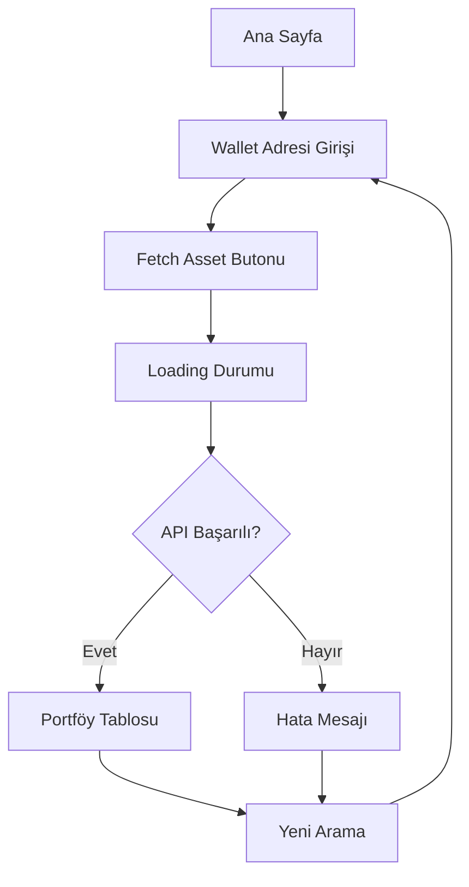

# Moralis Portfolio Tracker - Product Requirements Document

## 1. Product Overview

Moralis Portfolio Tracker, kullanıcıların Ethereum wallet adreslerini girerek kripto varlık portföylerini görüntüleyebilecekleri modern bir web uygulamasıdır. Moralis API v2.2 kullanarak gerçek zamanlı token verilerini çeker ve kullanıcı dostu bir arayüzde sunar.

Uygulama, kripto yatırımcılarının portföy performanslarını kolayca takip etmelerini sağlar ve token fiyatları, değerleri ve 24 saatlik değişimleri hakkında detaylı bilgi sunar.

## 2. Core Features

### 2.1 User Roles

Bu uygulama tek kullanıcı rolü ile çalışır - herhangi bir kayıt gerektirmez:

| Role | Registration Method | Core Permissions |
|------|---------------------|------------------|
| Visitor | Kayıt gerektirmez | Wallet adresi girip portföy verilerini görüntüleyebilir |

### 2.2 Feature Module

Portfolio Tracker uygulaması aşağıdaki ana sayfalardan oluşur:

1. **Ana Sayfa**: Wallet adresi giriş alanı, arama butonu, portföy tablosu ve loading/error durumları.

### 2.3 Page Details

| Page Name | Module Name | Feature description |
|-----------|-------------|---------------------|
| Ana Sayfa | Header Section | Uygulama başlığı ve açıklama metni gösterir |
| Ana Sayfa | Wallet Input | Ethereum wallet adresi girişi için text input ve arama butonu |
| Ana Sayfa | Portfolio Table | Token logosu, ismi, fiyatı, değeri ve 24h değişimi gösteren tablo |
| Ana Sayfa | Loading State | API çağrısı sırasında loading spinner veya skeleton gösterir |
| Ana Sayfa | Error Handling | API hatalarını kullanıcı dostu mesajlarla gösterir |
| Ana Sayfa | Empty State | Henüz arama yapılmadığında veya sonuç bulunamadığında bilgilendirme |

## 3. Core Process

**Ana Kullanıcı Akışı:**
1. Kullanıcı uygulamayı açar ve ana sayfayı görür
2. Ethereum wallet adresini (0x ile başlayan 42 karakter) input alanına girer
3. "Fetch Asset" butonuna tıklar
4. Uygulama Moralis API'sine istek gönderir ve loading durumunu gösterir
5. API'den gelen token verileri tablo formatında görüntülenir
6. Kullanıcı portföy bilgilerini inceleyebilir
7. Farklı bir wallet için arama yapmak isterse yeni adres girip tekrar arama yapabilir

## 4. User Interface Design

### 4.1 Design Style

- **Ana Renkler**: Beyaz arka plan (#ffffff), koyu metin (#333333)
- **Vurgu Renkleri**: Mavi (#007bff) butonlar için, yeşil (#28a745) pozitif değişimler, kırmızı (#dc3545) negatif değişimler
- **Buton Stili**: Rounded köşeli, modern flat design
- **Font**: System font stack (Arial, Helvetica, sans-serif)
- **Layout**: Merkezi hizalanmış, card-based tasarım
- **İkonlar**: Token logoları için circular avatarlar

### 4.2 Page Design Overview

| Page Name | Module Name | UI Elements |
|-----------|-------------|-------------|
| Ana Sayfa | Header | Büyük başlık (h1), merkezi hizalama, koyu renk |
| Ana Sayfa | Input Section | Text input (placeholder: "Enter wallet address"), mavi buton, horizontal layout |
| Ana Sayfa | Portfolio Table | Responsive tablo, header row, zebra striping, hover effects |
| Ana Sayfa | Token Row | Logo (32x32px), token ismi, fiyat ($), değer ($), yüzde değişimi (renkli) |
| Ana Sayfa | Loading | Spinner veya skeleton loading, merkezi hizalama |
| Ana Sayfa | Error State | Kırmızı border, hata ikonu, açıklayıcı mesaj |

### 4.3 Responsiveness

Uygulama desktop-first yaklaşımla tasarlanmış olup, tablet ve mobil cihazlarda responsive davranır:
- Desktop: Tam genişlik tablo
- Tablet: Horizontal scroll için tablo
- Mobile: Stack layout, kart görünümü
- Touch optimization: Büyük butonlar, kolay dokunma alanları